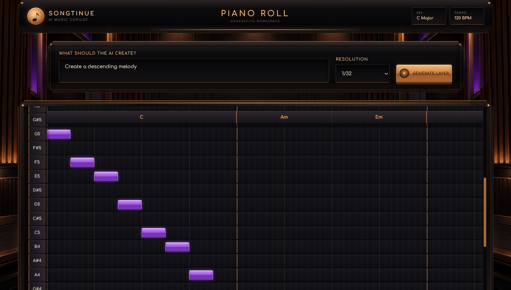
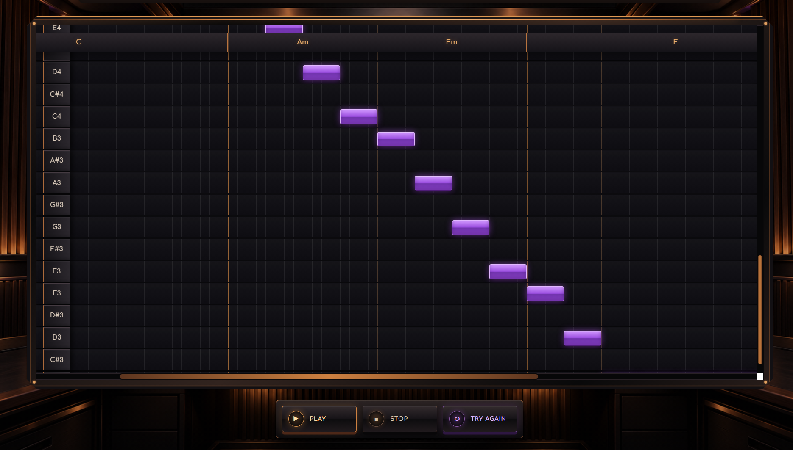

# Songtinue

An AI-powered music layer generator with a Piano Roll editor.

## Live demo

https://songtinue-web.onrender.com

## Screenshots

### Main screen


### Application preview




## Technology

- Frontend: React, TypeScript, Vite
- Backend: Python, FastAPI
- AI integration: OpenRouter
- Hosting: Render

## Local setup

Requires Python, Node.js, npm, and an OpenRouter API key.

### Backend

Open PowerShell in the project root:

```powershell
cd backend
python -m venv .venv
.\.venv\Scripts\python.exe -m pip install -r requirements.txt
Copy-Item .env.example .env
```

Edit `backend/.env` and replace the placeholder with your OpenRouter API key:

```dotenv
OPENROUTER_API_KEY=your_openrouter_api_key
FRONTEND_URL=http://localhost:5173
```

Start the backend from the `backend` directory:

```powershell
.\.venv\Scripts\python.exe -m uvicorn app.main:app --reload
```

Local API documentation:

http://127.0.0.1:8000/docs

### Frontend

Open a second PowerShell terminal in the project root:

```powershell
cd frontend
npm.cmd install
Copy-Item .env.example .env
npm.cmd run dev
```

The frontend environment file should contain:

```dotenv
VITE_API_URL=http://127.0.0.1:8000
```

Open the local URL printed by Vite.

Keep the OpenRouter API key in the backend environment only.
Do not commit private `.env` files.

## API endpoints

- `GET /health`: Checks whether the backend is running.
- `POST /layers/generate`: Generates a music layer from a song idea.

## Production build

From the project root:

```powershell
npm.cmd --prefix frontend run build
```

The frontend build output is saved in `frontend/dist`.

## Deployment configuration

### Backend

- Root directory: `backend`
- Build command: `pip install -r requirements.txt`
- Start command: `uvicorn app.main:app --host 0.0.0.0 --port $PORT`
- Environment variables:
  - `OPENROUTER_API_KEY`: Your OpenRouter API key
  - `FRONTEND_URL`: `https://songtinue-web.onrender.com`
  - `PYTHON_VERSION`: `3.14.5`

### Frontend

- Service type: Static Site
- Root directory: `frontend`
- Build command: `npm install && npm run build`
- Publish directory: `dist`
- Environment variables:
  - `VITE_API_URL`: `https://songtinue.onrender.com`
  - `NODE_VERSION`: `24.15.0`